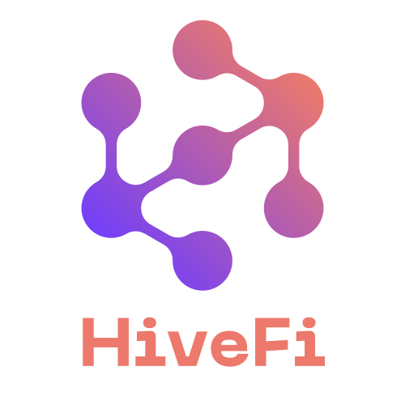

# HiveFi: Mantle DeFi Agent Swarm


<div align="center">
  
  <h3>Revolutionizing Mantle DeFi with AI-Powered Agent Swarms</h3>
  <p>Simplify your Mantle DeFi experience with the power of Multi-Agent Systems (MAS)</p>

  <p align="center">
    <a href="https://discord.gg/dP4VEAP8br">
      
    </a>
    <a href="https://x.com/HiveFiAgent">
      
    </a>
    <a href="https://youtu.be/48U3xAXCxqs">
      
    </a>
    <a href="https://linktr.ee/HiveFi">
      
    </a>
  </p>
  🔅 Sozu Virtual AI Hack Project 💥
</div>


---

## 📚 Table of Contents

- [🌟 Overview](#-overview)
- [✨ Features](#-features)
  - [Core Features](#core-features)
  - [Token Features](#token-features)
  - [Access Tiers](#access-tiers)
  - [Mantle Features](#mantle-features)
- [🤖 Agent Categories](#-agent-categories)
  - [Internal Agents](#-internal-agents-platform-operations)
  - [Public Agents](#-public-agents-shared-services)
  - [Private Agents](#-private-agents-custom-deployments)
- [💎 Service Packages](#service-packages)
- [🚀 Getting Started](#-getting-started)
- [💻 Web Client](#-web-client)
- [🛠️ Development](#️-development)
- [🤝 Contributing](#-contributing)
- [📄 License](#-license)

## 🌟 Overview

HiveFi is an innovative open-source project revolutionizing the Mantle DeFi landscape through AI-powered agent swarms. By employing a sophisticated multi-agent system, HiveFi streamlines and automates DeFi operations, offering users a seamless and efficient experience on Mantle. Its modular design ensures scalability and adaptability, empowering users to navigate the complexities of DeFi with ease and confidence.

You can find detailed information in our [technical specifications](docs/specs.md), [system overview](docs/overview.md), and [complete whitepaper](docs/whitepaper.md).

### Why Multi-Agent Systems (MAS)?

Our platform leverages a Multi-Agent System architecture where each agent specializes in specific tasks—from fetching metrics to executing trades—enabling modular, scalable, and efficient operations. This approach ensures:

- **🎯 Specialization**: Optimized performance through task-specific agents
- **📈 Scalability**: Easy addition of new agents and features
- **🛡️ Robustness**: Continued operation even if individual agents fail
- **⚡ Efficiency**: Parallel task execution for improved performance
- **🔄 Adaptability**: Seamless integration with new protocols and APIs

Learn more about our agent system in the [agents documentation](docs/agents.md).


<div align="center">
  
  <p><em>HiveFi Architecture</em></p>
</div>

## ✨ Features

### Core Features

- 💬 Natural language processing
- 🤖 Multi-Agent System (MAS): 18 AI Agents included.
- 🔅 Integrated Website & Web App
- 🛠️ Full-featured Discord, Twitter and Telegram connectors
- 🔗 Support for every model (Llama, Grok, OpenAI, Anthropic, etc.)
- 👥 Multi-agent and room support
- 📚 Easily ingest and interact with your documents
- 💾 Retrievable memory and document store
- 💰 Real-time prices using CoinGecko API
- 🚀 Real-time TVL using DefiLlama API
- 📝 Text generation and analysis
- 🎨 Image generation and description
- 🗣️ Speech synthesis and recognition
- 📊 Data visualization
- 🌐 Web browsing capabilities
- 🚀 Highly extensible - create your own actions and clients

### Mantle Features

- 💰 Wallet management
- 💸 Token transfers (ETH, USDT, MNT, and custom tokens)
- 💱 Token swapping on Merchant Moe
- 💎 Token and liquidity pool deployment
- 🔍 Transaction tracking
- 💧 Liquid staking on Mantle Staking


### 🖥️ Web App Features
- 🚀 Landing page
- 📄 Agents Directory
- 🤖 Chat with Agent Swarm through web interface
- 👛 Mantle wallet integration (Braavos, Argent X & MetaMask)
- 📊 Portfolio & Analytics dashboard
- 🎨 Modern, responsive design

<div align="center">
  
  <p><em>HiveFi Web Client</em></p>
</div>

## 🧰 Tech Stack

- ElizaOS
- Vite
- TailwindCSS
- ShadcnUI
- Typescript
- Python
- NodeJS


### 🤖 Agent Categories

For complete details about each agent's capabilities and use cases, see our [agents documentation](docs/agents.md) and [AI Workforce Suite documentation](docs/aiws.md).

#### 🏢 Internal Agents (Platform Operations)
1. 💼 Sales Agent: Customer relations and onboarding
2. 🎨 Meme Agent: Social media marketing agents promoting HiveFi
3. 🎮 Demo Agent: Interactive platform demonstration and feature showcase

#### 🌐 Public Agents (Shared Services)
4. 📊 Metrics Agent: Provides protocol TVL, prices, and performance metrics
5. 🔍 Alpha Agent: Market opportunities, Twitter and Web Scraping
6. 📈 Analyst Agent: Risks, performance, and market analysis
7. 🖼️ NFTs Agent: NFT intelligence and market analysis
8. 📣 KOL Agent: Social media service
9. 📝 Token Deployer: Token and liquidity pool deployment
10. 🎨 NFT Deployer: NFT Collection deployment
11. 🔷 Mantle Expert: Documentation, resources, tips and advice for Mantle users and devs
12. 🔮 Predictions Agent: Trend analysis and predictions

#### 🔒 Private Agents (Custom Deployments)
13. 🎮 Coordinator Agent: Task orchestration and management. One agent to rule them all.
14. 💱 DeFi Agent: Manages DeFi operations (Staking, Lending, Borrowing, Yield Farming, etc.)
15. 📈 Trading Agent: Manages trading operations (Swaps, position management, rebalancing, strategies, etc.)
16. 👛 Wallet Agent: Manages Mantle wallet operations (Transfers, Signatures, etc.)
17. 🏛️ DAO Agent: Manages DAO operations (Treasury management, proposal management, DAO metrics, etc.)
18. 💡 Advisor Agent: Manages strategy planning and provides advice


## 🏠 Self-Hosting (Recommended)

HiveFi is and will always be open source! We strongly encourage users to self-host their own instance of HiveFi. This gives you full control over your data and agents while learning about the technology.

For detailed implementation guidance, see our [plugin documentation](docs/plugin-hivefi.md).

### Requirements for Self-Hosting
- Server or cloud instance (e.g., AWS, DigitalOcean, or your local machine)
- API keys for required services.
- Basic knowledge of TypeScript/Node.js for customization

### Support
While self-hosting is a DIY approach, we provide:
- Detailed documentation
- Community support via Discord
- GitHub issues for bug reports
- Basic setup guidance

### Service Packages

> **Note**: The following service packages are not yet launched but will be available soon through early access. For now, we recommend self-hosting your own instance!

For detailed service descriptions and future offerings, see our [services documentation](docs/services.md) and [business plan](docs/business-plan.md).

#### 🚀 Starter Pack (Free)
- Basic Metrics Agent access
- Basic Mantle Expert Advisor
- Limited daily queries

#### 💎 DeFi Trader Pack
- Includes:
  - Private Coordinator Agent
  - Private Trading Agent
  - Private Wallet Agent
  - Premium Metrics Agent
  - Alpha Agent
  - Analyst Agent

#### 📣 Social Influencer Pack
- Includes:
  - KOL Agent
  - Alpha Agent
  - NFTs Agent
  - Premium Metrics Agent

#### 👨‍💻 Developer Pack
- Includes:
  - Token Deployer
  - NFT Deployer
  - Private Wallet Agent
  - Technical Support
  - Custom Development Hours

#### 🏢 Enterprise Pack
- Includes:
  - All Private Agents
  - Custom Development
  - White-label Options
  - 24/7 Support
  - Custom SLAs

## 🚀 Quick Start

### Prerequisites

- [Python 2.7+](https://www.python.org/downloads/)
- [Node.js 23+](https://docs.npmjs.com/downloading-and-installing-node-js-and-npm)
- [Git](https://git-scm.com/downloads)
- [pnpm](https://pnpm.io/installation)

> **Note for Windows Users:** [WSL 2](https://learn.microsoft.com/en-us/windows/wsl/install-manual) and [Visual Studio Build Tools](https://visualstudio.microsoft.com/downloads/) are required.

### Installation

```bash
# Clone the repository
git clone https://github.com/worksgoodcompany/hivefi
cd hivefi/eliza

# Install dependencies
pnpm install --no-frozen-lockfile

# Copy environment file
cp .env.example .env
```

### Configuration

Edit `.env` file and add your credentials:

```env
# Required for Mantle operations
EVM_PRIVATE_KEY=your_private_key
EVM_PROVIDER_URL=https://rpc.mantle.xyz

# Choose an API provider and add the API_KEY on the env file
OPENAI_API_KEY=                # OpenAI API key, starting with sk-
ANTHROPIC_API_KEY=             # For Claude (optional)

# Client Configuration
DISCORD_APPLICATION_ID=        # Discord bot ID
DISCORD_API_TOKEN=             # Discord bot token
TELEGRAM_BOT_TOKEN=            # Telegram bot token
TWITTER_USERNAME=              # Twitter username
TWITTER_PASSWORD=              # Twitter password
TWITTER_EMAIL=                 # Twitter email
```

### Running the Agent

```bash
# Build the project
pnpm build

# Start a single agent (Recommended for testing)
pnpm start --characters="characters/demo-agent.character.json"

# Start demo agents (4)
pnpm start --characters="characters/metrics-agent.character.json,characters/sales-agent.character.json,characters/meme-agent.character.json,characters/mantle-expert-agent.character.json"

# Start all agents (18)
pnpm start --characters="characters/coordinator.character.json,characters/metrics-agent.character.json,characters/sales-agent.character.json,characters/meme-agent.character.json,characters/nfts-agent.character.json,characters/alpha-agent.character.json,characters/analyst-agent.character.json,characters/trading-agent.character.json,characters/wallet-agent.character.json,characters/dao-agent.character.json,characters/defi-agent.character.json,characters/demo-agent.character.json,characters/kol-agent.character.json,characters/token-deployer-agent.character.json,characters/nft-deployer-agent.character.json,characters/mantle-expert-agent.character.json,characters/predictions-agent.character.json,characters/advisor-agent.character.json"
```

### Running the Web Client

In a new terminal, run the following command:

```bash
cd client
pnpm run dev
```

## 🧪 How to use?

For comprehensive usage examples and advanced features, see our [plugin documentation](docs/plugin-hivefi.md).

Interact with the agents with these example prompts:

### Network Information

```
What is Mantle Network?
```

### TVL Metrics

```
Get detailed TVL metrics for Mantle and global DeFi
```

### Price Metrics

```
Get prices for ETH, BTC, MNT
```

### Wallet Operations

```
Show me my Mantle wallet address and balances
```

```
Show my portfolio
```


### Token Transfers

```
Send 0.1 MNT to 0xF12d64817029755853bc74a585EcD162f63c5f84
```

```
Send 0.01 USDC to 0xF12d64817029755853bc74a585EcD162f63c5f84
```

```
Send 0.00001 METH to 0xF12d64817029755853bc74a585EcD162f63c5f84
```

### Token Swaps (Merchant Moe)

```
Swap 0.1 MNT for USDC
```

### Token Lending (INIT Capital)

```
Supply 0.1 USDC to lending pool
```

```
Withdraw 0.01 USDC from lending pool
```

```
Borrow 0.01 USDT from lending pool
```

```
Repay 0.001 USDT to lending pool
```


## 🔍 Important Notes

- Ensure you have sufficient funds for transaction fees.
- Always double-check addresses and amounts before executing transactions.

## 🛠️ Development

For detailed development roadmap and milestones, see our [development plan](docs/plan.md).

### Project Structure

```
README.md                       # This file
docs/                           # Documentation
  ├── aiws.md                   # AI Workforce Suite docs
  ├── business-plan.md          # Business plan and strategy
  ├── overview.md               # Project overview
  ├── plan.md                   # Development roadmap
  ├── plugin-hivefi.md          # HiveFi plugin documentation
  ├── specs.md                  # Technical specifications
  └── whitepaper.md             # Project whitepaper
assets/                         # Assets
starkhive-token/                # HiveFi Token Hardhat project
  ├── contracts/                # HiveFi Token contract
  │   └── HiveFiToken.sol    # HiveFi Token contract
  └── README.md                 # HiveFi Token README
  ...

eliza/                          # Eliza project
  ├── packages/
  │   ├── core/                 # Eliza core functionality
  │   ├── plugin-hivefi/         # Mantle integration
  │   │   ├── src/
  │   │   │   ├── actions/      
  │   │   │   ├── providers/    
  │   │   │   │   ├── coingecko     # CoinGecko API
  │   │   │   │   ├── defillama     # DefiLlama API
  │   │   │   └── ...
  │   │   ├── templates/    
  │   │   ├── types/        
  │   │   └── utils/        
  └── client/                   # Web App
```

## 🤝 Contributing

1. Fork the repository
2. Create your feature branch
3. Commit your changes
4. Push to the branch
5. Create a Pull Request

## 📄 License

This project is licensed under the MIT License - see the [LICENSE](LICENSE) file for details.

## 🤖 AI Workforce Suite

HiveFi is part of the broader [AI Workforce Suite (AIWS)](./docs/aiws.md), a collection of tools and platforms designed to enhance and automate various aspects of decentralized finance and blockchain interactions through advanced AI technologies.

---

<div align="center">
  <p>Built with ❤️ by the HiveFi team</p>
  <p>
    <a href="https://discord.gg/dP4VEAP8br">
      
    </a>
    <a href="https://x.com/HiveFiAgent">
      
    </a>
  </p>
</div>

